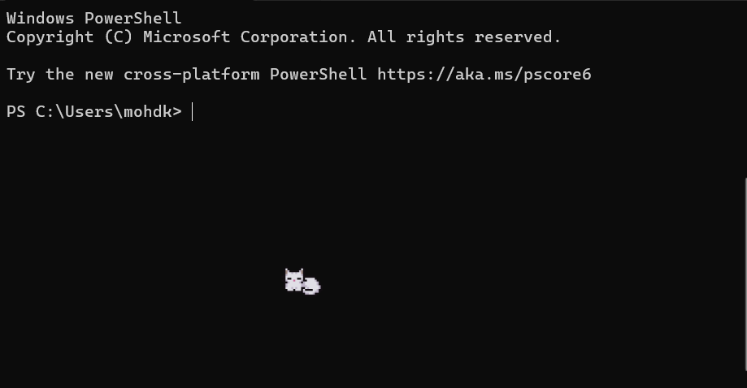

# scamp



A small animated cat that lives in your terminal and keeps you company while you work.

She wanders, sits, washes her paws, yawns, scratches, and sleeps in different poses. Walks left, right, up, and down with proper four-direction animations. Ignores you when she runs full-screen TUIs like vim or htop. Cleans up after herself when shell output scrolls past her.

**Three different cats ship with scamp** (gray, ginger tabby, white) and one is picked at random every time you launch. You can pin one by setting the `SCAMP_CAT` env var (see [Configure](#configure) below).

## Important: run scamp in Windows Terminal

scamp is built around **sixel graphics** for sharp pixel-art rendering. Sixel works in:

- **Windows Terminal** (recommended for Windows users; install free from the Microsoft Store, or `winget install Microsoft.WindowsTerminal`)
- WezTerm, iTerm2, foot, kitty, contour, recent xterm

In regular PowerShell windows, cmd.exe, and most IDE-integrated terminals (VS Code, Cursor, Antigravity), you get a **half-block fallback** that works but looks chunkier and less detailed. The cat is still a cat, just lower fidelity.

If you can, open Windows Terminal first, then launch scamp inside it. The visual difference is significant.

## Install

### Windows (no Rust needed)

Download `scamp.exe` from the [latest release](https://github.com/LordAizen1/scamp-cat/releases/latest), then run it inside Windows Terminal:

```
scamp.exe
```

### From source (any platform with Rust)

```
cargo install --git https://github.com/LordAizen1/scamp-cat
scamp
```

## Configure

Two environment variables.

`SCAMP_CAT` pins a specific cat color (default behavior is **random per launch** so each session feels a little different):
```
$env:SCAMP_CAT="gray"     # the dark-gray cat
$env:SCAMP_CAT="ginger"   # the orange tabby
$env:SCAMP_CAT="white"    # the white cat
scamp
```
Unset to go back to the random pick on each launch.

`SCAMP_RENDERER` overrides the auto-detected renderer:
```
$env:SCAMP_RENDERER="sixel"      # force pixel-perfect sixel
$env:SCAMP_RENDERER="halfblock"  # force the half-block fallback
```

By default scamp picks sixel when it detects a sixel-capable terminal (Windows Terminal, WezTerm, iTerm2, foot, kitty, contour) and half-block everywhere else.

## What's inside

- PTY wrapper (`portable-pty`) hosts your shell and forwards bytes both ways
- ANSI parser (`vte`) maintains a screen-cell model used to clean up after the sprite
- Sixel encoder (`icy_sixel`) for pixel-perfect rendering
- Half-block character renderer for fallback compatibility
- Atomic compositor: single buffered write per redraw, scroll-aware ghost cleanup, alt-screen pause, terminal resize handling

## Compat notes

| Terminal                    | Renderer    | Notes                              |
|-----------------------------|-------------|------------------------------------|
| Windows Terminal            | sixel       | First-class, looks great           |
| WezTerm, iTerm2, foot, kitty| sixel       | Detected via env vars              |
| ConHost (default cmd / PS)  | half-block  | Fallback, smaller and chunkier     |
| VS Code / Cursor / similar  | half-block  | Sixel possible if you enable it    |

To get the cat to look its best in your IDE terminal, enable `terminal.integrated.enableImages` in settings, then `$env:SCAMP_RENDERER="sixel"` before launching.

## Credits

Cat sprites by **Last tick** ([animated-pixel-kittens-cats-32x32](https://last-tick.itch.io/animated-pixel-kittens-cats-32x32) on itch.io). Used under the asset pack's license: free for personal and commercial use, redistribution as standalone art prohibited. The sprites are bundled into the scamp binary as part of a software product.

If you like the art, support the artist by visiting their itch.io page.

## License

scamp's source code is MIT licensed. See [LICENSE](LICENSE).

The bundled sprite assets are subject to Last tick's terms (see Credits above).
